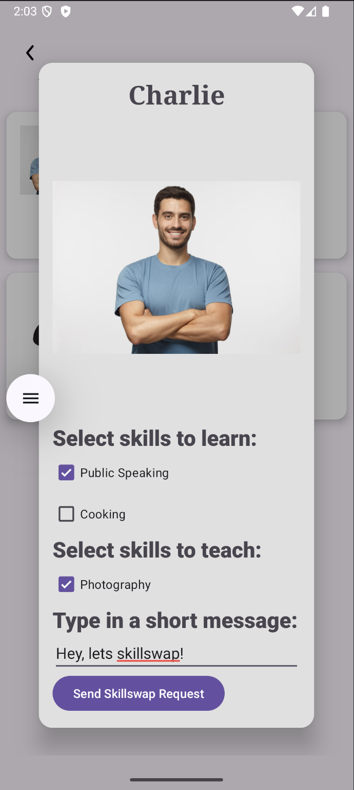

# Peer-to-Peer Skill Exchange Platform (POC)

## 🚀 About the Project

This is a proof-of-concept (POC) Android application designed to validate the **market fit** for a peer-to-peer skill exchange platform.

It enables users to:
- Create a profile listing the skills they can teach and want to learn.
- View potential matches based on shared skill interests.
- Send skill swap requests via a dialog interaction.

While the app currently uses dummy data for testing, it simulates the **core interaction loop** that would exist in a real-world skill exchange platform.

---

## 🎯 Goal of the POC

The objective is to test if the core concept is **desirable** to users, and whether they are willing to:
1. Explore potential matches.
2. Engage with other users based on mutual interests.
3. Initiate a skill swap.
4. Simulate an incoming skill swap request and the choice to accept / decline.

This helps determine **early product-market fit** before building out full backend and user management systems.

---

## 🧪 Key Features (POC Stage)

- **User Profile Page**
  - Displays current user's skills, image, and description.
    
  

- **Match Discovery Page**
  - Uses hardcoded dummy data to simulate available matches.
  - Swap left or right to remove an undesirable match card.
  - Card shows "Waiting for response.." for matches awaiting response after request is sent.
    
    

- **Send Request Interaction**
  - Users can tap on a match to open a dialog.
  - Dialog shows user info and allows sending a swap request by clicking on the "Send Skillswap Request" button. 
  - Click outside the dialog to cancel.
    
    
    
- **Receiving Request Interaction**
  - Users receives a dialog when another user sends in a swap request.
  - Users can choose to accept or decline the request.
    
    

---

## 🧭 Future Additions (Post-POC)

- "Check Current Requests" page (for pending or received requests).
- Gamified points reward system as incentives for users to teach and learn.
- Backend integration with real-time data and user authentication.
- Messaging and scheduling system between users.
- Match filtering by location, availability, or skill level.

---

## 💡 Why This POC is Valuable

Despite not being connected to real user data yet, this prototype simulates the **entire user flow** from discovery to engagement:

- We can observe **interest and intent** based on simulated user interactions.
- It enables early feedback and iteration **without a full backend**.
- Demonstrates feasibility of core matching logic and UX structure.

---

## 🧠 Some considerations

- Opted for a native matching logic instead for better control and debuggability instead of using open source libraries such as Fuse.js
- Skill matching logic uses levenshtein distance which is sufficient for the POC

---

## 📱 Built With

- Java + Android Studio
- XML for layouts
- Custom adapter and RecyclerView
- Dialog-based interaction

---

## 🧠 Inspiration

Inspired by the idea of **community-driven learning**, where people can grow by exchanging knowledge in a casual, decentralized way.

---

## 🙋 Contact

Developed by Nadine Verelia Moiras
nadineverelia@gmail.com
www.linkedin.com/in/nadinemoiras 

